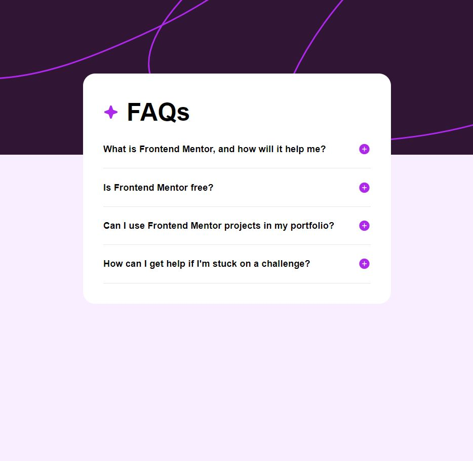

# Frontend Mentor - FAQ accordion solution

This is a solution to the [FAQ accordion challenge on Frontend Mentor](https://www.frontendmentor.io/challenges/faq-accordion-wyfFdeBwBz).

## Overview

### The challenge

Users should be able to:

- Hide/Show the answer to a question when the question is clicked
- Navigate the questions and hide/show answers using keyboard navigation alone
- View the optimal layout for the interface depending on their device's screen size
- See hover and focus states for all interactive elements on the page

### Screenshot

### Links

- Live Site URL: https://faq-accordion-nine-pi.vercel.app/

## My process

### Built with

- Flexbox
- CSS Grid
- Mobile-first workflow
- React
- Next.js
- Tailwind
- TypeScript

### What I learned

My first project with Next.js, Tailwind, and TypeScript.
I learned how to set up pages and components in Next.js, and how to use Tailwind CSS classes to style them.
Additionally, I explored TypeScript to enforce clear types.
